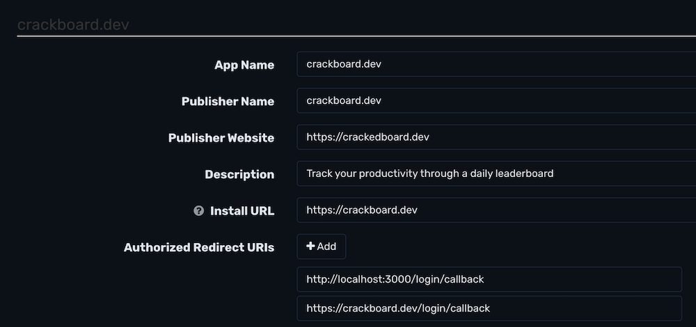

# crackedboard.dev

- Prod: https://crackedboard.dev
- Dev: http://localhost:3000

## Setup

Install [Postgres](https://postgresapp.com/).

```
git clone git@github.com:wakatime/crackboard.dev.git
cd crackboard.dev
psql -c "CREATE ROLE crackboarddev WITH LOGIN SUPERUSER PASSWORD 'crackboarddev';"
psql -c "CREATE DATABASE crackboarddev WITH OWNER crackboarddev;"
psql -d crackboarddev -c "CREATE EXTENSION citext;"
cp .env.example .env
pnpm i
pnpm migrate
pnpm dev
pnpm android
pnpm ios
```

## Tech Stack

- [Next.js](https://nextjs.org)
- [Drizzle](https://orm.drizzle.team/docs/overview)
- [Tailwind CSS](https://tailwindcss.com)
- [shadcn/ui](https://ui.shadcn.com/docs)
- [tRPC](https://trpc.io)
- [Expo](https://expo.dev/)
- [DigitalOcean App Platform](https://www.digitalocean.com/products/app-platform) or [Vercel](https://vercel.com/)

## Adding npm dependencies

To add a package, first choose the workspace(s) where it's going to be used then install for a workspace with:

`pnpm add <package> --filter=@workspace/web`

## Authentication

Auth is handled by logging in with WakaTime.
Create a new [WakaTime OAuth App](https://wakatime.com/apps):



Add your app’s `App ID` and `App Secret` to your local `.env` and your production app’s env vars:

`.env`

```
WAKATIME_APP_ID=1234
WAKATIME_APP_SECRET=waka_sec_123
```

## Admin

To access the admin, make sure you’re the first sign up and you'll become the leaderboard’s admin.
Then visit http://localhost:3000/admin.

## Use production API for local mobile

Set the `TEST_PROD` flag to true in `constants/index.ts` to use the production api server.

## Login on Dev Android Mobile Simulator

The Android simulator treats `localhost` as the simulator itself, so when logging in via GitHub just edit the localhost urls and replace with `10.0.2.2`.
